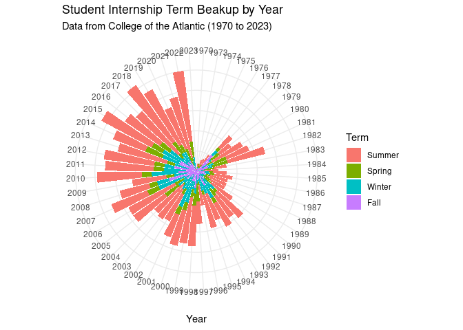
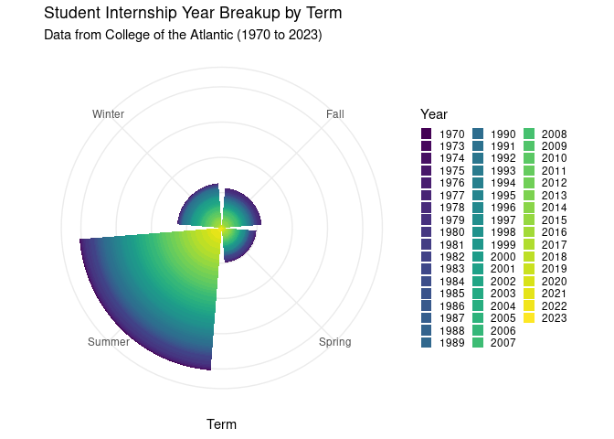

Project memo
================
Y & J Code Craze

This document should contain a detailed account of the data clean up for
your data and the design choices you are making for your plots. For
instance you will want to document choices you’ve made that were
intentional for your graphic, e.g. color you’ve chosen for the plot.
Think of this document as a code script someone can follow to reproduce
the data cleaning steps and graphics in your handout.

``` r
library(tidyverse)
library(broom)
Internship_Data_Untidy <- read.csv("/cloud/project/data/Internship_Data_Untidy.csv")
```

## Data Clean Up Steps for Overall Data

### Step 1: Tidy the Term Column

#### Step 1 a.) Change Entries with unknown term data to “NA” and unnesesary remove spaces before and after an entry

``` r
Internship_Data_Untidy %>% 
  mutate(Term = case_when( 
    Term %in% c("NA", "Not Stated", "-", "", "NA ", "All Year", "n/a", "Year", "Year-round", "N/A", "Previous Work Experience", "Nine Months", "Prior Fulfillment"))) ~ "NA" %>% 
  mutate(Term = str_squish(Term))
```

    ## Internship_Data_Untidy %>% mutate(Term = case_when(Term %in% 
    ##     c("NA", "Not Stated", "-", "", "NA ", "All Year", "n/a", 
    ##         "Year", "Year-round", "N/A", "Previous Work Experience", 
    ##         "Nine Months", "Prior Fulfillment"))) ~ "NA" %>% mutate(Term = str_squish(Term))

#### Step 1 b.) Ensure all terms fall under corespond to one COA term.

Because we are using the last recorded year from the “year” column, we
are also using the last recorded term. The last term of each entry
should correspond to the year the internship was completed

``` r
Tidy_Term <- Internship_Data_Untidy %>% 
mutate(Term = case_when(
  Term %in% c("Fall", "Winter, Spring, Fall", "Winter, Fall", "Summer-Fall", "Spring, Fall", "Summer/Fall", "Summer, Fall", "Spring, Summer, Fall", "Summer,Fall", "Winter+Fall") ~ "Fall",
  Term %in% c("Winter", "Winter, Fall, Winter", "Fall/Winter", "December-December", "Summer, Fall, Winter", "Fall-Winter", "Fall, Winter", "Summer-Winter") ~ "Winter",
  Term %in% c("Spring", "Fall, Winter, Spring", "spring", "Winter, Spring", "Winter-Spring", "Novermber-Spring", "Summer, Spring, Spring") ~ "Spring",
  Term %in% c("Summer", "Fall, Summer", "August", "Winter-Summer", "Winter, Spring, Summer", "Winter, Summer", "Spring, Summer", "Fall+Summer", "Spring/Summer", "Fall, Winter, Spring, Summer", "Summe", "Summer 2011") ~ "Summer"
))
```

#### Step 1 c.) Yay it’s tidy!

``` r
Tidy_Term %>% 
  group_by(Term) %>%
  summarise(count = n())
```

    ## # A tibble: 5 × 2
    ##   Term   count
    ##   <chr>  <int>
    ## 1 Fall     228
    ## 2 Spring   197
    ## 3 Summer   815
    ## 4 Winter   256
    ## 5 <NA>     153

### Step 2: Tidy the Year Column (All work applied to data frame “Tidy_Term”)

### Step 2 a.) Check for all unique variables within the Year coloumn

``` r
unique(Tidy_Term$Year)
```

    ##  [1] "2015"             "2011"             "2017"             "1997"            
    ##  [5] "2009"             "2007"             "1976-79"          "2014"            
    ##  [9] "2019"             "1999"             "2016"             "2010"            
    ## [13] "1991"             "2004"             "2002"             "1994"            
    ## [17] "2022"             "1996-1999"        "1995"             "2001"            
    ## [21] "1990"             "1985"             "2005"             "2013"            
    ## [25] "1996"             "1987"             "1979"             "1998"            
    ## [29] "1982"             "2009-2011"        "2020"             "2021"            
    ## [33] "1992"             "1988"             "2006"             "2000"            
    ## [37] "1993"             "1986"             "2003"             "2012"            
    ## [41] "2018"             "1977"             "2008"             "1976"            
    ## [45] "1978"             "1973"             "1974, 1975"       "1997, 1998, 1999"
    ## [49] "1983"             "1980"             "1984"             "1996-2008"       
    ## [53] "1989"             "1981"             "1974"             "1995, 1996"      
    ## [57] "1990s?"           "2003, 2004, 2005" NA                 "2013-2014"       
    ## [61] "1978, 1979, 1980" "2015, 2016, 2017" "2017-18"          "Varied"          
    ## [65] "2002-03"          "1975"             "1981, 1982"       "1981-1983"       
    ## [69] "2002 - 2009"      "2014-15"          "1979 and 1980"    "2023"            
    ## [73] "1973, 1974, 1975" "≤2000"            "1977, 1975, 1972" "2001, 2002"      
    ## [77] "1985, 1986"       "1987, 1988"       "1998/1999"        "1994-1997"       
    ## [81] "2006, 2007"       ""                 "1977, 1978"       "1987-1993"       
    ## [85] "2009-2010"        "1970"             "1984, 1985"       "1997, 1998"      
    ## [89] "1989-1996"        "2001-2002"        "2015, 2016"       "1994-95"         
    ## [93] "1994, 1995, 1996" "1980-1982"

### Step 2 b.) Ensure all variables follow same format

The format is simply to state the year as a 4 digit integer. “XXXX”. We
were instructed by Jeffry to use the latest year for entries that span
across multiple years.

``` r
Tidy_Time <- Tidy_Term %>% 
mutate(Year = case_when(
  Year %in% c("1970") ~ "1970",
  Year %in% c("1973", "1973, 1974, 1975") ~ "1973",
  Year %in% c("1974") ~ "1974",
  Year %in% c("1975", "1974, 1975") ~ "1975",
  Year %in% c("1976") ~"1976",
  Year %in% c("1977", "1977, 1975, 1972") ~ "1977",
  Year %in% c("1978", "1977,1978") ~ "1978",
  Year %in% c("1979","1976-79") ~ "1979",
  Year %in% c("1980", "1978, 1979, 1980", "1979 and 1980") ~ "1980",
  Year %in% c("1981") ~ "1981",
  Year %in% c("1982", "1981, 1982") ~ "1982",
  Year %in% c("1983","1981-1983") ~ "1983",
  Year %in% c("1984") ~ "1984",
  Year %in% c("1985", "1984, 1985") ~ "1985",
  Year %in% c("1986", "1985, 1986") ~ "1986",
  Year %in% c("1987") ~"1987",
  Year %in% c("1988", "1987, 1988") ~ "1988",
  Year %in% c("1989") ~ "1989",
  Year %in% c("1990") ~ "1990",
  Year %in% c("1991") ~ "1991",
  Year %in% c("1992") ~ "1992",
  Year %in% c("1993", "1987-1993") ~ "1993",
  Year %in% c("1994") ~ "1994",
  Year %in% c("1995") ~ "1995",
  Year %in% c("1996", "1994, 1995, 1996", "1995, 1996") ~ "1996",
  Year %in% c("1997") ~ "1997",
  Year %in% c("1998", " 1997, 1998") ~ "1998",
  Year %in% c("1999", "1997, 1998, 1999", "1998/1999") ~ "1999",
  Year %in% c("2000") ~ "2000",
  Year %in% c("2001") ~ "2001",
  Year %in% c("2002", "2001, 2002") ~ "2002",
  Year %in% c("2003") ~ "2003",
  Year %in% c("2004") ~"2004",
  Year %in% c("2005", "2003, 2004, 2005") ~ "2005",
  Year %in% c("2006") ~ "2006",
  Year %in% c("2007", "2006, 2007") ~ "2007",
  Year %in% c("2008", "1996-2008") ~ "2008",
  Year %in% c("2009","2002 - 2009") ~ "2009",
  Year %in% c("2010", "2009-2010") ~ "2010",
  Year %in% c("2011","  2009-2011") ~ "2011",
  Year %in% c("2012") ~ "2012",
  Year %in% c("2013") ~ "2013",
  Year %in% c("2014", " 2013-2014") ~ "2014",
  Year %in% c("2015", "2014-15") ~ "2015",
  Year %in% c("2016", " 2015, 2016") ~ "2016",
  Year %in% c("2017", " 2015, 2016, 2017") ~ "2017",
  Year %in% c("2018") ~ "2018",
  Year %in% c("2019") ~ "2019",
  Year %in% c("2020") ~ "2020",
  Year %in% c("2021") ~ "2021",
  Year %in% c("2022") ~ "2022",
  Year %in% c("2023") ~ "2023"
))
```

### Step 2 c.) Double check unique terms

``` r
Tidy_Time %>% 
  group_by(Year) %>%
  summarise(count = n())
```

    ## # A tibble: 53 × 2
    ##    Year  count
    ##    <chr> <int>
    ##  1 1970      1
    ##  2 1973      5
    ##  3 1974      4
    ##  4 1975      6
    ##  5 1976      8
    ##  6 1977     11
    ##  7 1978     24
    ##  8 1979     23
    ##  9 1980     27
    ## 10 1981     28
    ## # ℹ 43 more rows

yay! it’s all tidy!

## Plots

### ggsave example for saving plots

``` r
exp1 <- starwars |>
  filter(mass < 1000, 
         species %in% c("Human", "Cerean", "Pau'an", "Droid", "Gungan")) |>
  ggplot() +
  geom_point(aes(x = mass, 
                 y = height, 
                 color = species)) +
  labs(x = "Weight (kg)", 
       y = "Height (m)",
       color = "Species",
       title = "Weight and Height of Select Starwars Species",
       caption = paste("This data comes from the starwars api: https://swapi.py43.com"))


ggsave("example-starwars.png", width = 4, height = 4)

ggsave("example-starwars-wide.png", width = 6, height = 4)
```

### Plot 1: Year-Term Bar Polar Chart

``` r
# Summarise the data by Year and Term
Tidy_Time_Summary <- Tidy_Time %>%
  drop_na(Term) %>% 
  drop_na(Year) %>% 
  group_by(Year, Term) %>%
  summarise(count = n()) %>%
  ungroup()
```

    ## `summarise()` has grouped output by 'Year'. You can override using the
    ## `.groups` argument.

``` r
Tidy_Time_Summary %>% 
  ggplot(aes(x = Year, y = count, fill = fct_relevel(Term, c("Summer", "Spring", "Winter", "Fall")))) + 
  geom_bar(stat = "identity", position = "stack") + 
  coord_polar(start = 0) + 
  labs(
    title = "Student Internship Term Beakup by Year",
    subtitle = "Data from College of the Atlantic (1970 to 2023)",
    x = "Year",
    fill = "Term") +
  theme_minimal() +
  theme(axis.title.y = element_blank(),
        axis.line = element_blank(), 
        axis.ticks = element_blank(),
        axis.text.y = element_blank())
```

<!-- -->

``` r
Tidy_Time_Summary %>% 
  ggplot(aes(x = Term, y = count, fill = Year)) + 
  geom_bar(stat = "identity", position = "stack") + 
  coord_polar(start = 0) + 
  labs(
    title = "Student Internship Year Breakup by Term",
    subtitle = "Data from College of the Atlantic (1970 to 2023)",
    x = "Term") + 
  theme_minimal() +  
  theme(axis.title.y = element_blank(),
        axis.text.y = element_blank(),
        legend.key.size = unit(0.7, "lines")) +
  scale_fill_viridis_d()
```

<!-- -->

### Plot 2: \_\_\_\_\_\_\_\_\_

### Plot 3: \_\_\_\_\_\_\_\_\_\_\_

Add more plot sections as needed. Each project should have at least 3
plots, but talk to me if you have fewer than 3.

### Plot 4: \_\_\_\_\_\_\_\_\_\_\_
